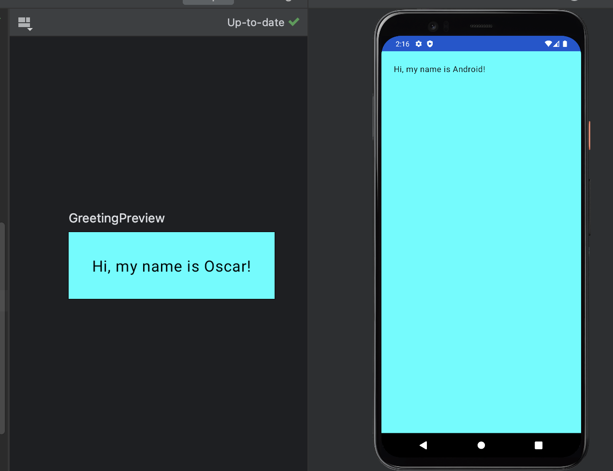

# First Android App

  

## Overview

This project is part of the official Android Basics in Kotlin course. The goal is to create my first Android App, while getting in touch with @Composable, @Preview decorators and the Modifier interface.

## Course Details

To follow along with the tutorial and understand the concepts covered in this project, you can visit the official Android Developer website:

[Android Basics in Kotlin - Compose Unit 1 Pathway 2, Create your first Android app](https://developer.android.com/courses/pathways/android-basics-compose-unit-1-pathway-2)